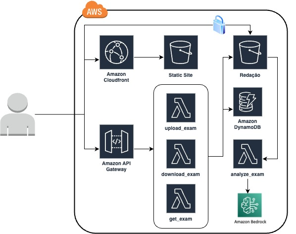

# Exam Correction

Writing and Multiple Answer Questions (MAQ) correction

# Requirements

Node.js v20.14.0, NPM 10.7.0, Python 3.10 or above

# Steps

Run Backend environments before Frontend environments


# My Env



# Backend

## Requirements

Python3

## Valid AWS Credentias

use aws configure or export valid AWS_ACCESS_KEY_ID and AWS_SECRET_ACCESS_KEY

## Build & Deploy

```bash
DEPLOY_REGION=us-east-1 #or can be changed to another AWS Region
sam validate
sam build
sam deploy --region $DEPLOY_REGION --stack-name exam-correction --resolve-s3 --resolve-image-repos --capabilities CAPABILITY_AUTO_EXPAND CAPABILITY_IAM --no-confirm-changeset --parameter-overrides PythonVersion=`python3 --version | sed 's/ //g' | cut -d '.' -f 1,2 | tr '[:upper:]' '[:lower:]'`
```


## Delete

```bash
sam delete --stack-name exam-correction
```

# Frontend

## Requirements

Request access to Amazon Bedrock Model Claude 3 Sonnet

-----
## Install

```bash
npm install

URL_API=$(aws cloudformation describe-stacks --stack-name  exam-correction --query "Stacks[0].Outputs[?OutputKey=='ExamsApi'].OutputValue" --output text)
cat ../frontend/src/services/api_template.js | sed -e "s|API_GATEWAY_URL|$URL_API|" > ../frontend/src/services/api.js
```
-----
## Run local

```bash
npm start
```
-----
## Build

```bash
npm run build
```
-----
## Deploy

```bash
aws cloudformation create-stack --stack-name exam-frontend --template-body file://template.yaml
aws cloudformation wait stack-create-complete --stack-name exam-frontend
bucket_name=$(aws cloudformation describe-stacks --stack-name exam-frontend --query 'Stacks[0].Outputs[?OutputKey==`BucketName`].OutputValue' --output text)
cloudfront_id=$(aws cloudformation describe-stacks --stack-name exam-frontend --query 'Stacks[0].Outputs[?OutputKey==`CFDistributionID`].OutputValue' --output text)
cloudfront_name=$(aws cloudformation describe-stacks --stack-name exam-frontend --query 'Stacks[0].Outputs[?OutputKey==`CFDistributionName`].OutputValue' --output text)

aws s3 sync ./build s3://$bucket_name
aws cloudfront create-invalidation --distribution-id $cloudfront_id --paths "/*"
echo $cloudfront_name
```
-----
## Delete

```bash
aws s3 rm s3://$bucket_name --recursive
aws cloudformation delete-stack --stack-name exam-frontend
aws cloudformation wait stack-delete-complete --stack-name exam-frontend
```
-----

# Extra modules

**Scanner module** to sync local scanner device with S3 Bucket exam

-----

**Alexa Skill module** to create an Alexa Skill to interact with solution


